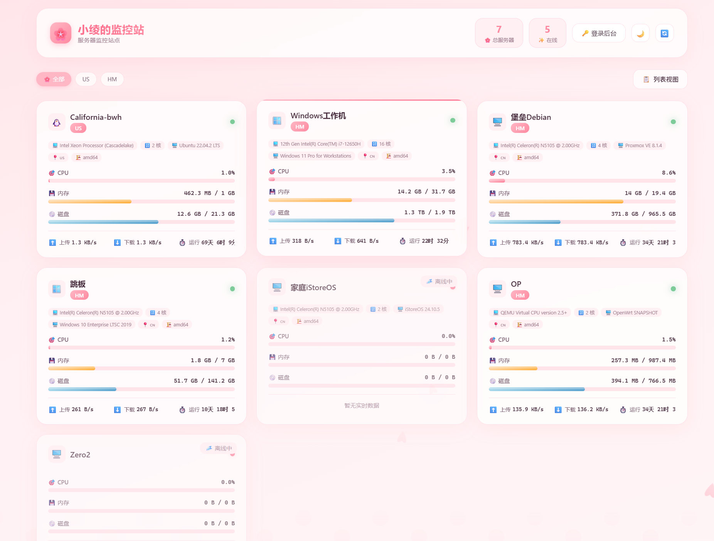

# Sakura Monitor

一款唯美樱花飘落动画的二次元风格 Komari 服务器监控主题。

## 效果展示

## 特性

- 樱花飘落粒子动画背景
- 支持亮色/暗色主题切换
- 玻璃拟态、扁平化、毛玻璃三种卡片样式
- 服务器历史负载图表
- WebSocket 实时数据更新

## 配置项

| 配置项 | 类型 | 默认值 | 说明 |
|--------|------|--------|------|
| 花瓣数量 | number | 30 | 屏幕上飘落的樱花花瓣数量（10-60） |
| 花瓣飘落速度 | number | 3 | 樱花花瓣飘落的速度倍率（1-10） |
| 卡片样式 | select | 玻璃拟态 | 服务器信息卡片的展示样式 |
| 自动刷新间隔 | number | 5 | WebSocket 断开时自动刷新间隔（秒） |
| 显示历史图表 | switch | true | 是否在服务器详情页显示历史负载图表 |

## 安装使用

1. 进入管理后台将zip压缩包上传
2. 在 Komari 后台选择 **Sakura** 主题
3. 根据需要调整配置项

## 作者

小绫

## 开源协议

MIT License
